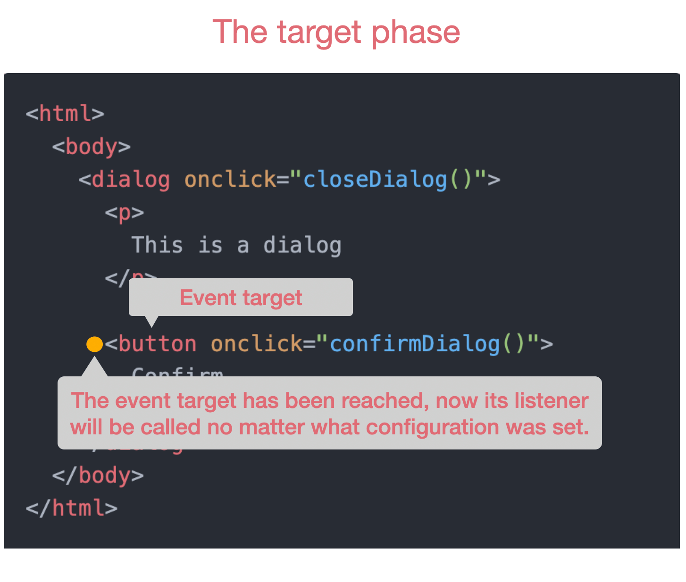

Dealing with DOM events is usually not a big deal if the task in hand is simple. Things such as toggling the visibility of a `div` when clicking something, or switching the color of a button when you hover it, and a lot of other daily simple tasks that we need to do as web developers usually bring no big challenges even for more junior devs.

But I would bet all the pennies in my pocket that every experienced developer at one point tried to close a pop-up when clicking outside of it just to find themselves accidentally closing it when clicking anywhere inside of it too! Then they probably ended up googling it, finding some stuff about some 'propagation' which they didn't really understand, and suddenly after copy pasting some code it started working as intended, ending up like this:


To really understand what was causing that behavior and stop being that copy cat developer we need to first understand how the DOM handles its events, and that's when the great event capturing and bubbling phases come into play.

## How DOM Events work

Have you ever stopped to think about how events are handled by the browser? If so, you probably imagined something like "_okay so I'll set this function to be called when this button is clicked, then probably the browser will now somehow tell that button to start listening for clicks and call this function whenever that happens, that's probably right_".

I think that this thought process is extremely common because it kinda makes sense and it feels almost imperative, which makes it easier to comprehend. First you have a button that does nothing when clicked, so it makes sense to think that the button is not listening to anything. Then you attach the function to the button click handler, and now suddenly the button starts listening to clicks. But yeah, that's kinda completely wrong.

The main problem with that thought process is to assume that the button is actually listening for clicks or any other event. This is the exact kind of thought that creates the pop-up bug for instance, because we think that events are listened and handled exclusively by the element we attached them to. **No element in the whole DOM listens to events, the DOM is the one listening.**

### - The capturing phase

Below you can see an animated representation of the event capturing phase flow when a button is clicked, with the yellow dot representing the event and how it traverses the DOM tree.

<video autoplay loop playsinline muted>
  <source src="event-capturing-flow.webm" />
  <source src="event-capturing-flow.mp4" />
</video>

Whenever an event such as a click on a button is triggered, the DOM needs to move that yellow dot all the way from the `<html>` element down to the clicked button element.

During the capturing phase the yellow dot needs to go through each element until it reaches the event target. Each of these elements will be the `event.currentTarget`. For each element it will check if it has a listener for the fired event. If the listener is set then it will be called, **but only if that listener is set to be called during the capturing phase** (which is not the default behavior, needing to be explicitly enabled with the `useCapture` option when attaching the listener).

In the animation below you can see that even though the `<dialog>` element has a listener set on the `onclick` event, it won't be called during the capturing phase because that's not the default behavior. It would be called only if you would explicitly configure the listener to be called during the capturing phase.

<video autoplay loop playsinline muted>
  <source src="event-capturing-flow-2.webm" />
  <source src="event-capturing-flow-2.mp4" />
</video>

**The propagation of the event all the way from the top element down to the event target while checking and calling listeners is what we call event capturing phase**.

---

### - The target phase

The target phase is somewhat of an intermediary phase between the capturing and bubbling.

It takes place right after we reach the `event.target` during the capturing phase, and in this phase the listener will be called no matter if you configured it to `useCapture` or not. That's because this is the deepest point of the event journey through the DOM tree, where the only thing that matters is for the listener to be called.



After this point we stop traversing down the DOM tree, giving room for the last phase.

---

### - The bubbling phase

After a long journey for the event from the top most element all the way down to the event target, it's time to come back.

The bubbling phase will be almost identical to the capturing phase, with the biggest difference being that now the event will go from the event target all the way up until it reaches the `<html>` again, finishing its life cycle until the day that it will be possibly fired again.

During its way up, the event will still be checking each element for an attached listener, but this time instead of calling the ones that had the `useCapture` options set to `true`, it will call only the ones that are set to `false`, which will happen in most of the cases since that's the default value for it.

Check the animation below representing the bubbling phase, and if the pop-up bug was still a mystery for you, I'm certain that it will make total sense now.

<video autoplay loop playsinline muted>
  <source src="event-bubbling-flow.webm" />
  <source src="event-bubbling-flow.mp4" />
</video>

**The propagation of the event all the way from the event target up to the `<html>` while checking and calling listeners is what we call event bubbling phase.**

---

## Thoughts about the pop-up bug

Now that you understand how the DOM really deals with events you certainly understand the problem with that pop-up closing every time we click inside of it, right?

When you attach that listener to the `<dialog>` you're not telling the browser to call it exactly when the dialog is clicked, you're actually telling it that **whenever a click event reaches the dialog the listener will be called**.

But now you're smart enough to know that this event can actually reach the dialog in **3 different ways**. It could reach it during the **capturing phase** in case a child of the dialog was clicked and the event is propagating down. It could reach it during the **target phase** in case that precisely the dialog was clicked. Or it could reach it during the **bubbling phase** in case a child of the dialog was clicked and the event is propagating up.

So yeah, you understand the problem, but it doesn't really help with the bug because you still don't know how to fix it. For that we'll take a look at some tricks that will help you control these events and make them work to your benefit.

### - Stopping the propagation of events

If you really understood the whole cycle of the event you probably know that the pop-up bug could be fixed if we had a way to stop the event from bubbling up past the dialog, because if it continues to bubble up it will eventually **always** call the `closeDialog()` method.

Lucky for us there is the `event.stopPropagation` method that does exactly that. So the bug fix would look something like this:

```html
<html>
  <body>
    <div class="dialog-overlay">
      <dialog>
        <p>This is a dialog</p>
        <button>Click me</button>
      </dialog>
    </div>
  </body>
</html>
```

```js
function closeDialog() {
  document.querySelector('.dialog-overlay').classList.add('hidden');
}

function stopEventPropagation(event) {
  event.stopPropagation();
}

document.addEventListener('.dialog-overlay', closeDialog);
document.addEventListener('dialog', stopEventPropagation);
```

You can see that both listeners were set to be called in the bubbling phase (as default), but when the event bubbles until it reaches the `<dialog>` element it will stop its propagation, preventing it from going further up.

What that means is that the event will never reach the `.dialog-overlay` when bubbling, it will only be reached in case it's the actual event target, or if we intentionally set the `useCapture` option to true, which will allow it to be reached during the capturing phase.

### - Benefits of event propagation

We saw a pretty hairy bug caused by lacking knowledge about the event propagation, but the same thing that caused us this bug is the one that helps us everyday, and most of the time without us even noticing.

Imagine that you have the following card component:

```html
<article class="card">
  <header>
    <h1>Card title</h1>
  </header>
  <div class="card-content">
    <p>The card content</p>
  </div>
</article>
```

Now imagine that you want to navigate to another page every time you click on the card, no matter where inside of it you click.

If it weren't for the event propagation you'd have to attach listeners to every single element inside of the card, but since we're taking advantage of it we can simply attach the listener to the `.card` element and not really care about the event target. All we care is that the event eventually bubbled up to the card and that's enough for us to know that it was clicked.

Another similar but not so obvious case happened with me while using React and trying to attach events to dynamically created elements.

I had a component that used the `dangerouslySetInnerHTML` React API to dynamically generate HTML, and it looked kinda like this:

```js
const component = dynamicHTML => {
  return <div dangerouslySetInnerHTML={{ __html: dynamicHTML }} />;
};
```

How would you possibly handle events from elements inside of that dynamic HTML? I can't really define an `onClick` prop to them since I don't have access to the actual elements, they're created dynamically somewhere else.

Well, the obvious answer (if you understand how events work) is simply this:

```js
const handleClick = event => {
  if (event.target.tagName === 'A') {
    // do stuff when an anchor is clicked
  }
  if (event.target.tagName === 'BUTTON') {
    // do stuff when a button is clicked
  }
};
const component = dynamicHTML => {
  return (
    <div
      onClick={handleClick}
      dangerouslySetInnerHTML={{ __html: dynamicHTML }}
    />
  );
};
```

And again this works because we can handle events anywhere in the DOM due to the event propagation, so I just moved the handling to the closest parent of that dynamic generated content and made some checks to know which element was in fact clicked.

The exact same thing happens when we have a `<button>` with a `<span>` inside of it. Chances are we're probably always actually clicking the `<span>` and not exactly the `<button>`, but since we usually don't care about the event target it goes unnoticed thanks to bubbling.

## Conclusion

In this article we learned that events are not handled by elements themselves whenever the event is fired on that element. In fact it's impossible to fire an event to a single element.

Events are always fired to the DOM and it is the DOM that will listen to them and check each element in the entire tree until it reaches the target of the event, just to go all the way back up calling every listener that it finds on the way in a process that we usually call **event capturing and bubbling**.

Understanding that whole process also allowed us to take great advantage of this propagation, handling events not always in its target but anywhere in the DOM tree.

The initially presented bug was easily fixed with that knowledge, and I really hope you'll know what you're doing now when setting an event listener to an element.

With this I finish this article with the hope to have taught you something valuable today. Be nice to people out there and happy coding!
